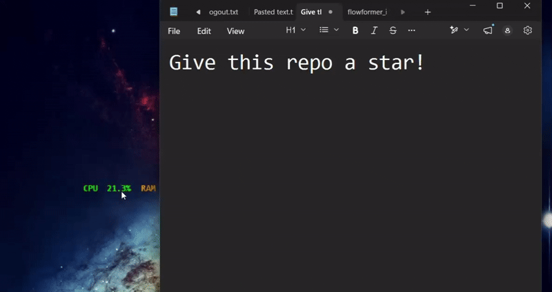

# ⚡ Overlay Stats


**A zero-bloat, ultra-lightweight CPU & RAM stats overlay for Windows.** Tired of heavy PC monitoring software eating up the resources they are supposed to be measuring? **Overlay Stats** is built in Rust to have a virtually non-existent footprint. It sits quietly on your screen, giving you exactly the data you need with zero distractions.

 
*(See it in action: Drag, toggle transparency, and enable click-through)*

---

### Features

* **Zero-Bloat:** Written in Rust using native Windows APIs. No Electron, no web views, just raw performance.
* **Fully Draggable:** Simply click and drag to snap the widget anywhere on your screen.
* **Transparent Mode:** Blends seamlessly into your desktop or games (enabled by default).
* **Click-Through Mode:** Lock the overlay in place and click right through it without interrupting your workflow or gameplay.
* **Always-On-Top:** Keep your stats visible over any application.
* **Smart Persistence:** Your preferences and screen coordinates are automatically saved to a local `config.json`. It remembers exactly where you left it.

---

### Hotkeys

| Key | Action |
| :--- | :--- |
| `F8` | Toggle background panel (Transparent vs. Dark panel) |
| `F9` | Toggle Always-on-top |
| `F10` | Toggle Click-through mode |

---

### Installation

You can run Overlay Stats exactly how you prefer—no heavy installation required unless you want it.

**Option 1: Portable Executable (Recommended)**
1. Go to the **Releases** tab on the right side of this repository.
2. Download `overlay-stats-portable.exe`.
3. Put it in a folder of your choice and run it! A `config.json` will be generated in the same directory.

**Option 2: Windows Installer**
1. Go to the **Releases** tab.
2. Download `OverlayStats-Setup.exe`.
3. Run the installer to add it to your Programs and create a desktop shortcut.

---

### Configuration

The overlay automatically creates a `config.json` next to the executable on its first run. You can manually edit this file to fine-tune your setup:

```json
{
  "always_on_top": true,
  "show_background": false,
  "click_through": false,
  "x": 1500,
  "y": 50
}
```

---

### Roadmap

Overlay Stats currently tracks CPU and RAM, but we are expanding to make it the ultimate lightweight dashboard. Coming soon:

- [ ] GPU Load Tracking
- [ ] CPU & GPU Temperature Monitoring
- [ ] In-Game FPS Counter

---

### Author & Contributing

Built by [Vansh Goyal](https://github.com/vansh-goyal) (Update link with your exact GitHub URL). 


Pull requests are always welcome! If you want to tackle any of the features on the roadmap, feel free to open an issue to discuss it.